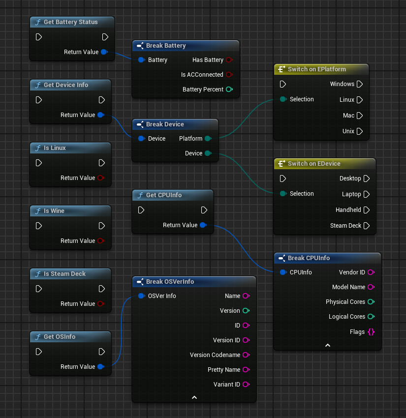

  

# HarmonyLink Unreal Engine 5 Plugin

This repository hosts the Unreal Engine 5 plugin for HarmonyLink, designed to provide real-time device metrics for handheld gaming, enhancing both gameplay and immersion.

## Features

- **Intelligent Hardware Recognition**: HarmonyLink 2.0 can accurately identify specific devices like the Steam Deck without relying on manual environment variables or command line arguments.
  
- **Robust API**: The API provided by HarmonyLink 2.0 offers developers straightforward and effortless access to detailed system information. Designed with intuitiveness in mind, it allows for rapid integration into projects, minimizing development overhead.

- **Enhanced Adaptability**: With the ability to dynamically adjust game settings and performance based on detected hardware capabilities and current operating conditions, HarmonyLink 2.0 ensures games are optimized for each specific device.

- **Wine Environment Detection**: HarmonyLink 2.0 includes mechanisms to detect when it is running within a Wine environment, enabling it to deliver system information about the underlying Linux system while operating through Wine.

- **Precise Steam Deck Hardware Detection**: Unlike conventional methods that may rely on environment variables, HarmonyLink 2.0 detects the presence of Steam Deck hardware directly, ensuring reliable identification and optimization for this specific device.

- **Battery and Charging Status Awareness**: The software provides real-time data on battery levels and charging status, allowing games to adapt their behavior based on power availability and to manage resource usage effectively.

- **Cross-Platform Functionality**: HarmonyLink 2.0 is designed to work on Windows (including Wine environments) as well as natively on Linux, offering broad support for a variety of gaming setups.

## Media

Watch the HarmonyLink Plugin in action, demonstrating its impact on gameplay through a Minecraft mod example:

    

    

  

The above image showcases the Unreal Engine 5 blueprint nodes provided by the HarmonyLink Plugin, which facilitate real-time communication between the game and device metrics.

## Requirements

- Unreal Engine 5.x (backwards compatible with 4.x)

## Getting Started

1. Clone this repository.
2. Place the `HarmonyLinkPlugin` folder into your Unreal Engine project's `Plugins` directory.
3. Open your project; the plugin should be detected automatically or enabled manually in the Plugins window.

## Contributing

Your contributions are welcome! Please fork, make changes in a separate branch, and submit a pull request.

## License

Licensed under the [MIT License](LICENSE).

## Contact

For inquiries or issues, reach out or open an issue on GitHub.

## Acknowledgements

- Full HarmonyLinkLib source code is available [here](https://github.com/Jordonbc/HarmonyLink).
